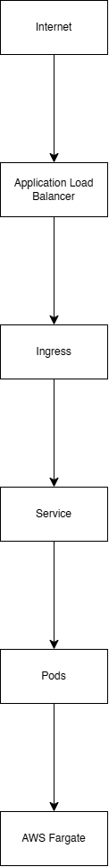
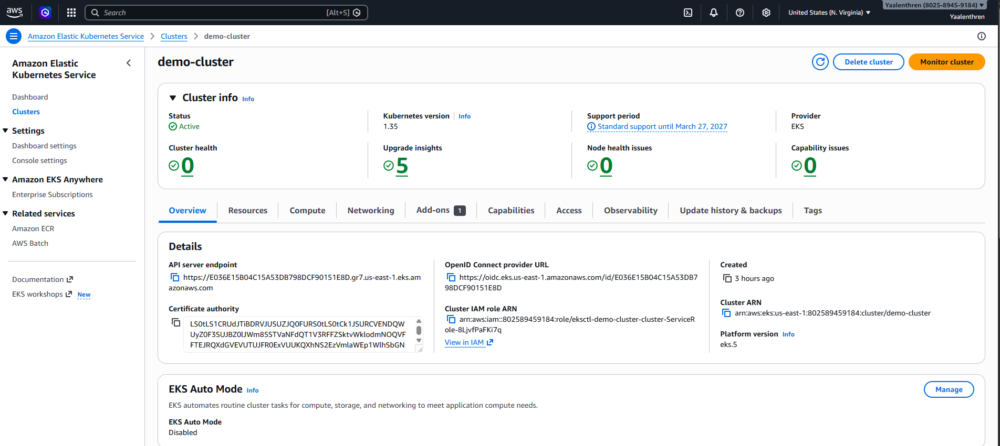
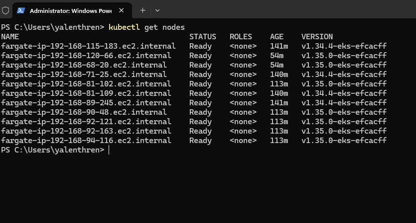
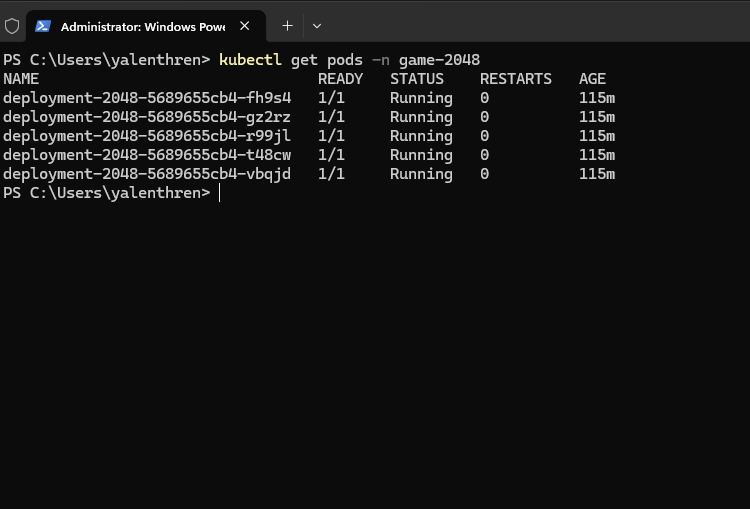
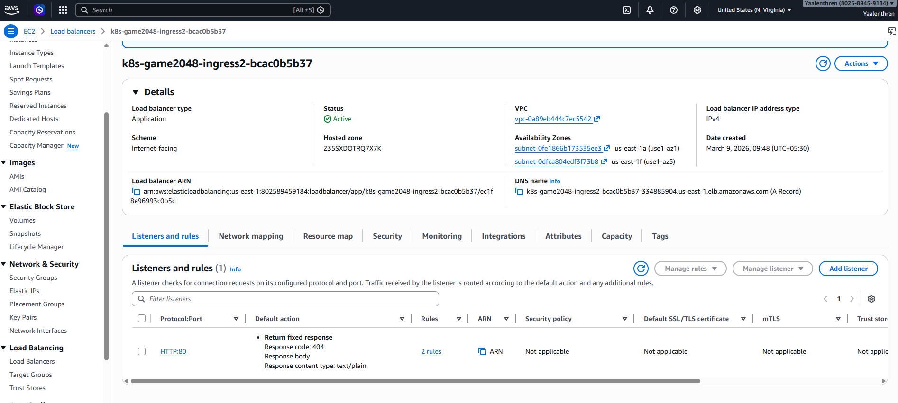
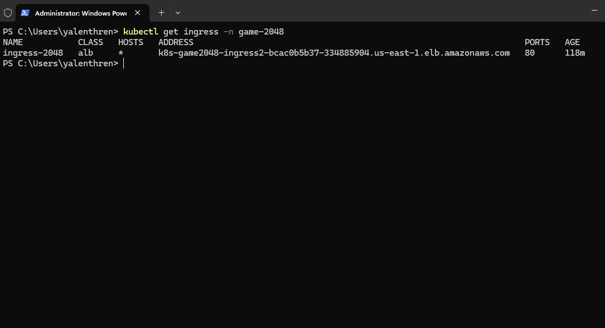
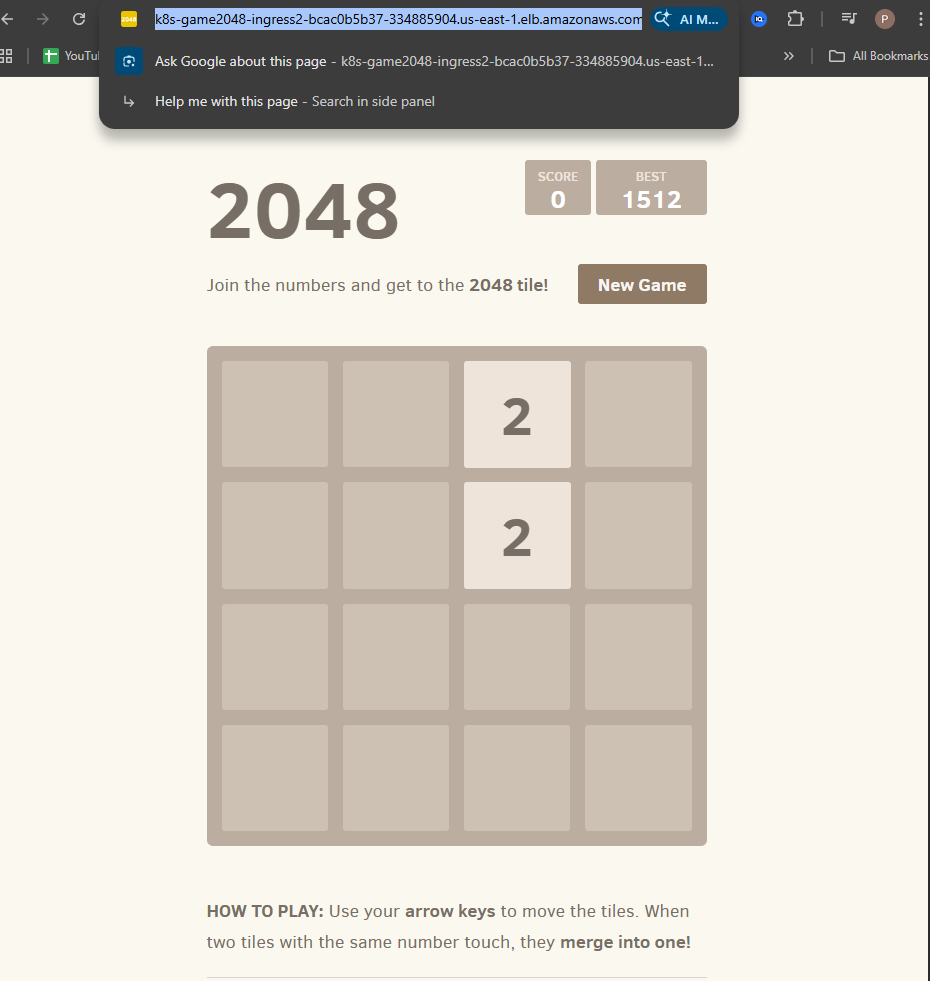

# AWS EKS Kubernetes Deployment with Fargate

This project demonstrates how to deploy a containerized application on AWS using Kubernetes with Amazon EKS and AWS Fargate.

The application deployed is the classic **2048 web game**, exposed to the internet using an AWS Application Load Balancer and Kubernetes Ingress.

---

## Architecture Overview

The deployment architecture follows this flow:

Internet  
↓  
AWS Application Load Balancer  
↓  
Kubernetes Ingress  
↓  
Kubernetes Service  
↓  
Pods running the 2048 application  
↓  
AWS Fargate compute  

See architecture diagram:



---

## Technologies Used

- Kubernetes
- Amazon EKS
- AWS Fargate
- AWS Load Balancer Controller
- Helm
- kubectl
- eksctl

---

## Project Structure

```
eks-fargate-kubernetes-2048-deployment
│
├── README.md
├── architecture
│   └── architecture-diagram.png
│
├── kubernetes
│   └── 2048_full.yaml
│
├── screenshots
│   ├── eks-cluster.png
│   ├── kubectl-nodes.png
│   ├── pods-running.png
│   ├── alb-created.png
│   ├── ingress-output.png
│   └── game-running.png
```

---

## Deployment Steps

### 1. Create EKS Cluster

```
eksctl create cluster --name demo-cluster --region us-east-1 --fargate
```

This command creates:

- EKS control plane
- VPC
- subnets
- security groups
- Fargate profile

---

### 2. Verify Nodes

```
kubectl get nodes
```

---

### 3. Deploy Application

```
kubectl apply -f kubernetes/2048_full.yaml
```

---

### 4. Install AWS Load Balancer Controller

Using Helm:

```
helm install aws-load-balancer-controller ...
```

This controller automatically creates an AWS Application Load Balancer when an Ingress resource is detected.

---

### 5. Access the Application

Retrieve the ingress endpoint:

```
kubectl get ingress -n game-2048
```

Open the ALB DNS name in a browser to access the application.

---

## Screenshots

### EKS Cluster


### Kubernetes Nodes


### Running Pods


### Application Load Balancer


### Ingress Output


### Application Running


---

## Learning Outcomes

Through this project I learned:

- How to deploy applications to Kubernetes
- How Amazon EKS manages Kubernetes clusters
- How to run Kubernetes workloads using AWS Fargate
- How to expose services using Kubernetes Ingress
- How to integrate AWS Application Load Balancer with Kubernetes
- How IAM roles and OIDC are used for Kubernetes service accounts

---

## Cleanup

To avoid AWS charges, delete the cluster after testing:

```
eksctl delete cluster --name demo-cluster --region us-east-1
```

---

## Author

DevOps learning project created as part of my cloud and Kubernetes learning journey.
